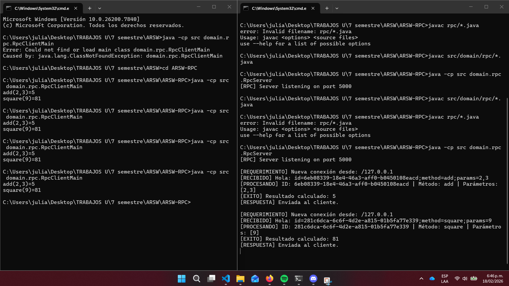

 # ARSW-RPC
# Escuela Colombiana de Ingeniería – Arquitecturas de Software  

Proyecto de ejemplo para la materia Arquitecturas de Software (Escuela Colombiana de Ingeniería). 
Implementa un RPC sencillo con un cliente y servidor de calculadora basado en el taller CallReturn.


- **Lenguaje:** Java

**Estructura principal**
- `src/domain/rpc/` - implementación del servicio RPC y cliente/servidor.
  - `CalculatorService.java` - interfaz del servicio
  - `CalculatorServiceImpl.java` - implementación del servicio
  - `CalculatorClientStub.java` - stub cliente
  - `RpcServer.java` - servidor RPC
  - `RpcClientMain.java` - cliente de ejemplo (main)
  - `RpcProtocol.java` - protocolo RPC (mensajería)

## Requisitos
- Java JDK 11+ instalado y en `PATH`.
- (Opcional) IDE como IntelliJ IDEA o Eclipse para abrir el proyecto.

### Instalación
---

1. Clonar el repositorio a la maquina local:
   ```bash
    git clone <URL_DEL_REPOSITORIO>
    ```
2. Navegar al directorio del repositorio
    ```bash
    cd <NOMBRE_DEL_PROYECTO>
    ```

## Compilar y ejecutar (desde la raíz del proyecto)

1) Compilar las clases:

```bash
javac src/domain/rpc/*.java
```

2) Ejecutar el servidor (en una consola):

```bash
java -cp src domain.rpc.RpcServer
```

3) En otra consola, ejecutar el cliente de ejemplo:

```bash
java -cp src domain.rpc.RpcClientMain
```

Salida esperada (ejemplo):

```
add(2,3)=5
square(9)=81
```


## Uso básico
- El `RpcServer` expone operaciones de calculadora.
- `RpcClientMain` usa `CalculatorClientStub` para invocar operaciones remotas.


## Licencia
Este proyecto sigue la licencia incluida en el repositorio.

---
## Ejecucion en consola

---

## 🙋 Autor

* **Julian Camilo Lopez Barrero** - [JulianLopez11](https://github.com/JulianLopez11)